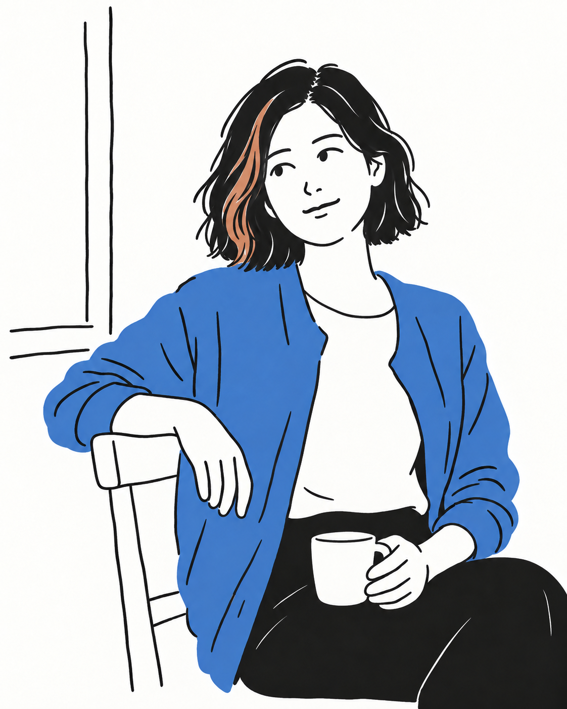

# Photo Doodle｜照片转日常手绘插画

一个以人物照片转绘为主的 Codex Skill。它把肖像、穿搭和日常动作重构为留白充足、线条略带手绘起伏、局部平涂的插画，同时保留原人物的发型、表情、姿势与服装特征。也可用于人与宠物、场景及静物照片。

## 人物转绘对比

以下两组示例的“照片”均为专门生成的演示素材，不是真人用户上传的照片；左右图片分别是同一画面的转绘前后。

### 1. 近景人像

| 示例照片 | 使用 Photo Doodle 转绘 |
| :---: | :---: |
|  |  |

保留了短发上的铜色挑染、视线与微笑、搭在椅背上的手、蓝色开衫和白色杯子；简化了脸部、针织纹理与室内背景。

### 2. 全身穿搭与动作

| 示例照片 | 使用 Photo Doodle 转绘 |
| :---: | :---: |
|  |  |

保留了卷发与眼镜、行走时的重心、左手插兜、右手提布袋以及红蓝两处关键色彩；将石墙和路面压缩为大面积留白与一条地面线。

### 补充：静物

| 示例照片（生成素材） | 使用 Photo Doodle 转绘 |
| :---: | :---: |
|  |  |

这组示例保留杯子、三本书和玻璃瓶的相对位置，删去材质纹理与光影，展示 Skill 对非人物照片的扩展用途。

## 安装

把仓库克隆到 Codex 的 Skills 目录：

```sh
git clone https://github.com/miso-zm/photo-doodle.git ~/.codex/skills/photo-doodle
```

如果你的电脑上已经有 `~/.codex/skills/photo-doodle`，无需再次克隆。重新打开 Codex 任务后即可使用 `$photo-doodle`。

## 具体用法

1. 在 Codex 对话中上传一张人物照片。半身肖像、全身穿搭、人物动作或人与宠物的合照都适用。
2. 在同一条消息里调用 Skill，并说清楚哪些特征必须保留。例如：

   ```text
   请使用 $photo-doodle 转绘这张照片。保留人物的姿势、发型和衣服颜色；背景只留下能说明场景的少量线条。
   ```

3. Codex 会把照片作为内容依据，读取本仓库的风格基准图进行转绘，再检查主体、线条、脸部简化和色块是否符合规则。你可以针对一个具体问题继续提出修改，例如“保留原来的挑染位置”或“线条再自然一点”。

若照片是全身人物，可以更明确地指出：

```text
请使用 $photo-doodle 转绘这张全身照。保留发型、眼镜、行走姿势、红色外衫和蓝色布袋；把街道背景简化为少量线条。
```

生成结果会随图像工具和输入照片而变化；上方对比图展示的是一次具体示例。

## 风格要点

- 以原照片为准，保留主体身份、姿势、互动和有辨识度的颜色；不替换成固定 IP 角色。
- 用中等偏轻的黑色手绘线条、简化的五官、清晰的发型色块和充足留白表达画面。
- 黑色块保持完整；彩色色块保持平静，不加入彩铅、水彩、马克笔条带或颗粒滤镜。
- 背景只保留一到三个解释空间关系的线索，不描摹照片的每个细节。

## 文件说明

- `SKILL.md`：转绘流程、视觉规则和提示词框架。
- `references/`：风格细则、不同照片类型的简化方法和结果检查清单。
- `assets/`：整体风格、全身配色、线条粗细以及五官与色块的基准图。
- `examples/`：两组人物照片及一组补充静物的转绘前后示例。
- `agents/openai.yaml`：Codex 中显示的 Skill 信息。

公开版没有收录开发过程中参考的两张外部插画，因为其公开转载权限尚未确认。
